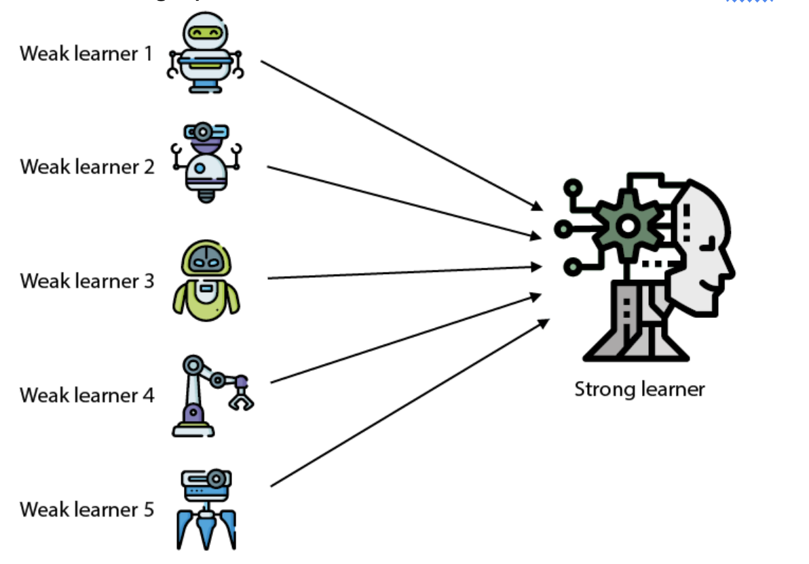
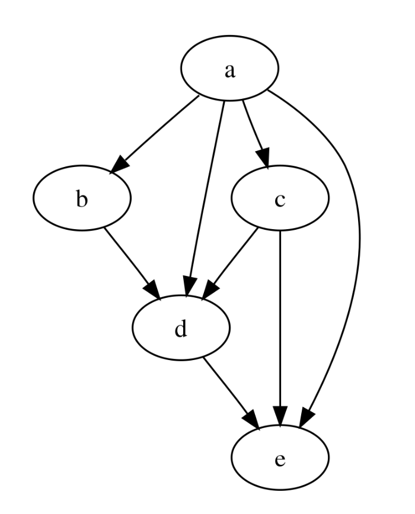
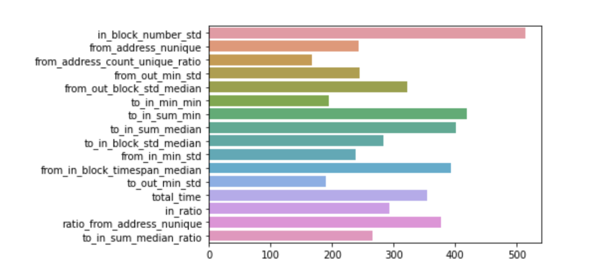

# Ethereum Phishing Scam Detection ML Model

## Description

This bot utilizes the [EasyEnsembleClassifier](https://imbalanced-learn.org/stable/references/generated/imblearn.ensemble.EasyEnsembleClassifier.html) with [lightbgm classifiers](https://lightgbm.readthedocs.io/en/stable/pythonapi/lightgbm.LGBMClassifier.html#lightgbm.LGBMClassifier) to detect EOA phishing scammers. The model input data and algorithm was inspired by this paper: [Phishing Scam Detection on Ethereum: Towards Financial Security for
Blockchain Ecosystem](https://www.ijcai.org/proceedings/2020/0621.pdf)

### Machine Learning Model Description

```
EasyEnsembleClassifier(base_estimator=LGBMClassifier(learning_rate=0.02,
                                                     num_leaves=50,
                                                     random_state=42),
                       n_jobs=-1, random_state=42, sampling_strategy=0.01,
                       verbose=10)
```

EasyEnsemble is an ensemble of weak learners that uses undersampling to improve classification on imbalanced datasets. This works well for phishing scam detection because a very small percentage of addresses are scammers. I used LGB estimators for the weak learners. LGB, a distributed high-performance framework that uses decision tree.



This machine learning model was trained to detect phishing scammers. The model outputs a prediction score between 0 and 1 (inclusive). Scores closer to 1 indicate that the address is most likely a phishing scammer. A threshold variable called `MODEL_THRESHOLD` is set to only consider alerting phishing scammers if the prediction score exceeds the specified threshold. If the threshold is exceeded, the analyzed address is considered a phishing scammer. The metadata will output model predictions as string labels `PHISHING_SCAMMER` and `NORMAL` for human readability.

The model detected 43 of **80** known scam addresses with `MODEL_THRESHOLD=0.5`, including 3 of the following known phishing scammer addresses:

* [0x00000000e1a1a7883c90afc22f106f78084ebbfe](https://etherscan.io/address/0x00000000e1a1a7883c90afc22f106f78084ebbfe) # Fake_Phishing76195
* [0xc6f5341d0cfea47660985b1245387ebc0dbb6a12](https://etherscan.io/address/0xc6f5341d0cfea47660985b1245387ebc0dbb6a12) # Fake_Phishing65972
* [0x2d12bd467ff3f6422dfbcad01342e1410cfc8ee8](https://etherscan.io/address/0x2d12bd467ff3f6422dfbcad01342e1410cfc8ee8) # [The scam detector feed](https://explorer.forta.network/bot/0x1d646c4045189991fdfd24a66b192a294158b839a6ec121d740474bdacb3ab23) also identified this address as a native ice phishing scammer.

**What features were used?**

* Addresses’ incoming and outgoing transaction count, blocknumber,  and value
* Addresses’ 1-degree neighbors’ transaction activity to identify money laundering and mass scamming activities.




**Metrics**

The model was evaluated against the test set from the [Kaggle competition](https://www.kaggle.com/competitions/forta-protect-web3/data):

* 131,277 non-scammers
* 443 known scammers
* Precision: `0.69`
* Recall: `0.44`
* F1-score: `0.54`

The model did well on a dataset of recent scams from May and June of 2023.
It identified **54%** of known scams with **88%** precision.

```
               precision    recall  f1-score   support

       normal       0.49      0.85      0.62        41
phishing-scam       0.88      0.54      0.67        80

     accuracy                           0.64       121
    macro avg       0.68      0.70      0.64       121
 weighted avg       0.74      0.64      0.65       121
 ```

**ML Features**





* to_friends: EOAs’ first-degree neighbors who received a transaction from the EOAs
* from_friends: EOAs’ first-degree neighbors who sent a transaction to the EOAs

1. `in_block_number_std`: standard deviation of incoming transaction block number
2. `from_address_nunique`: unique number of from addresses
3. `from_address_count_unique_ratio`: unique # of from addresses / total # of from addresses
4. `from_out_min_std`: minimum of from friends` standard deviation outgoing transaction values
5. `from_out_block_std_median`: median of from friends`standard deviation of outgoing transaction block number
6. `to_in_min_min`: minimum of to friends` minimum incoming transaction value
7. `to_in_sum_min`: sum of to friends` minimum incoming transaction value
8. `to_in_sum_median`: sum of to friends` median incoming transaction value
9. `to_in_block_std_median`: median of to friends` std incoming block number
10. `from_in_min_std`: minimum of from friends` standard deviation of incoming transaction values
11. `from_in_block_timespan_median`: median of from friends` incoming transaction time spans
12. `to_out_min_std`: minimum of to friends` standard deviation of outgoing transaction values
13. `total_time`: last tx time - first tx time
14. `in_ratio`: minimum incoming eth / maximum incoming eth
15. `ratio_from_address_nunique`: unique # of from addresses / (total num transactions)
16. `to_in_sum_median_ratio`: `to_in_sum_median` / total sum of incoming and outgoing value


## Supported Chains

- Ethereum

## Alerts

- EOA-PHISHING-SCAMMER
  - Fired when a from or to address from a transaction is identified as a phishing scammer.
  - Severity is always set to `CRITICAL`
  - Type is always set to `SUSPICIOUS`
  - Metadata includes model features and model prediction values. It also includes feature generation and prediction response times.


## Test Data

### Phishing Scammer Alert Example

```bash
$ npm run tx 0x3dd20a427489cec65c333cfdbc9d76c8533b57e9735961bead79a9d6729c3dd1
...
1 findings for transaction 0x3dd20a427489cec65c333cfdbc9d76c8533b57e9735961bead79a9d6729c3dd1 {
  "name": "Phishing Scammer Detected",
  "description": "0xc6f5341d0cfea47660985b1245387ebc0dbb6a12 has been identified as a phishing scammer",
  "alertId": "EOA-PHISHING-SCAMMER",
  "protocol": "ethereum",
  "severity": "Critical",
  "type": "Suspicious",
  "metadata": {
    "scammer": "0xc6f5341d0cfea47660985b1245387ebc0dbb6a12",
    "feature_generation_time_sec": 55.393977834,
    "prediction_time_sec": 3.258650750000001,
    "feature_1_from_address_count_unique_ratio": 0.8977777777777778,
    "feature_2_from_address_nunique": 202,
    "feature_3_in_block_number_std": 103944.45395073255,
    "feature_4_in_ratio": 0.0000027220471162690886,
    "feature_5_ratio_from_address_nunique": 0.6824324324324325,
    "feature_6_total_time": 9495012,
    "feature_7_from_in_min_std": 0,
    "feature_8_from_in_block_timespan_median": 477557,
    "feature_9_from_out_min_std": 0,
    "feature_10_from_out_block_std_median": 166256.50317778645,
    "feature_11_to_in_sum_min": 48516.30387100715,
    "feature_12_to_in_sum_median": 196337.4491312858,
    "feature_13_to_in_sum_median_ratio": 5190.0165806816785,
    "feature_14_to_in_min_min": 1e-18,
    "feature_15_to_in_block_std_median": 236914.9074575176,
    "feature_16_to_out_min_std": 0,
    "anomaly_score": 1,
    "model_version": "1678286940",
    "model_threshold": 0.5
  },
  "addresses": [],
  "labels": [
    {
      "entityType": "Address",
      "entity": "0xc6f5341d0cfea47660985b1245387ebc0dbb6a12",
      "label": "scammer-eoa",
      "confidence": 0.659,
      "remove": false,
      "metadata": {}
    }
  ]
}
```
